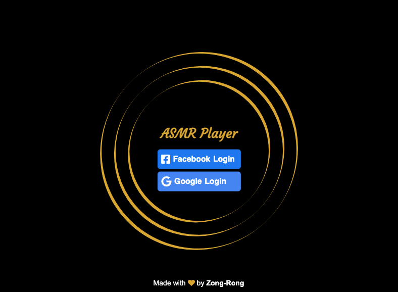
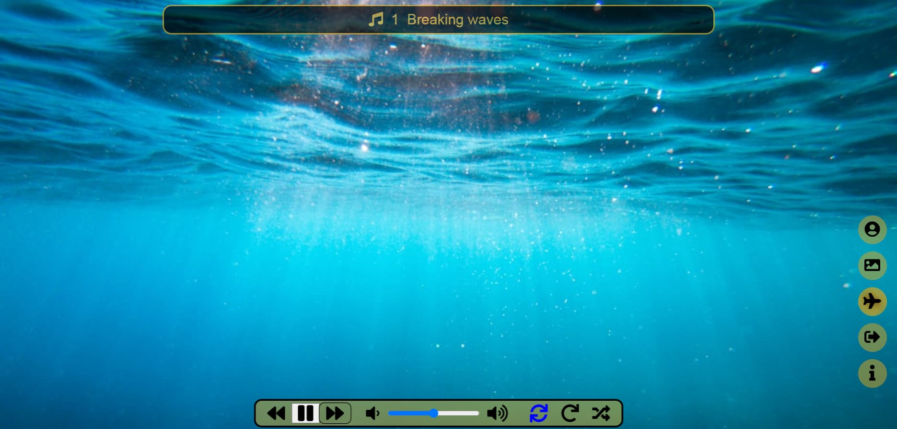

# ASMR Player



**ASMR Player** combines both ambient audio recordings and visual images to provide an immersive, relaxing listening experience for the user.

This web app is a personal side project built on React and supported technologies.

Try out the [demo app](https://asmr-player-312716.web.app/) on Firebase.

## :beginner: Purpose

I built this web app to hone and improve on my technical proficiency:

- React ecosystem: [React](https://reactjs.org), [Redux Toolkit](https://redux-toolkit.js.org/), [React Redux](https://react-redux.js.org/), [React Router](https://v5.reactrouter.com/web/guides/quick-start), and [Emotion.js](https://emotion.sh/docs/introduction)
- Firebase: [Hosting](https://firebase.google.com/docs/hosting), [Authentication](https://firebase.google.com/docs/auth), and [Cloud Storage](https://firebase.google.com/docs/storage)
- Third-party resources: [Unsplash API](https://unsplash.com/developers), [BBC Sound Effects](https://sound-effects.bbcrewind.co.uk), and [Font Awesome](https://fontawesome.com)

## :musical_note: Features


<small>:framed_picture: Credit: [Cristian Palmer](https://unsplash.com/photos/XexawgzYOBc)</small>

- Access to eight audio recordings stored in Firebase Cloud Storage.
- Two kinds of app backdrops:
  - **Animated color-gradient backdrop**: This backdrop is available when you are online or offline.
  - **Unsplash photographs**: This kind of backdrop shows a random image that matches the current audio's theme. It is available only when there's Internet connection.
- Draggable control panel with audio controls and three playback modes:
  - **Full album loop** (default): the app plays all tracks in the album in sequence repeatedly.
  - **Single track loop**: the app repeates single audio track.
  - **Shuffle**: the app plays the album tracks in random order. The playback is not repeated.
- Access control via Facebook and Google logins (powered by Firebase).
- Routing control for handling invalid user-input URLs and unauthenticated access.
- Responsive to desktop and mobile devices.
- Retaining backdrop images fetched from Unsplash for one hour to minimize API requests while ensuring smooth user experience.

## :mag: How to use it

1. Clone this project to your computer:
   `git clone https://github.com/zongronghuang/asmr-player.git`

2. Install required packages:
   `npm install`

3. Provide the environment variables required in an `.env` file:

   ```
   HTTPS=true

   // Unsplash API
   REACT_APP_BASE_URL=https://api.unsplash.com/
   REACT_APP_ACCESS_KEY=<YOUR ACCESS KEY>

   // Facebook login
   REACT_APP_FB_APP_ID=<YOUR APP ID>
   REACT_APP_FB_API_VERSION=<YOUR API VERSION>

   // Firebase
   REACT_APP_FIREBASE_API_KEY=<YOUR API KEY>
   REACT_APP_FIREBASE_AUTH_DOMAIN=<YOUR AUTH DOMAIN>
   REACT_APP_FIREBASE_PROJECT_ID=<YOUR PROJECT ID>
   REACT_APP_FIREBASE_STORAGE_BUCKET=<YOUR STORAGE BUCKET>
   REACT_APP_FIREBASE_DATABASE_URL=<YOUR DATABASE URL>
   REACT_APP_FIREBASE_MESSAGING_SENDER_ID=<YOUR MESSAGING SENDER ID>
   REACT_APP_FIREBASE_APP_ID=<YOUR APP ID>
   ```

4. Start this web app:
   `npm start`

5. Open the web app via a web browser:
   `https://localhost:3000` or `https://192.168.0.38:3000`

## :gem: Audio and visual materials

:notes: [BBC Sound Effects](https://sound-effects.bbcrewind.co.uk)

This website offers a rich collection of ambiental sounds, copyrighted by BBC, for non-comercial use.

:framed_picture: [Unsplash](https://unsplash.com/)

Random photographic works displayed in the online mode come from Unsplash.

## :open_book: Copyright

I am the copyright holder of this software project. Feel free to fork and exert your creativity!

The copyright of the audio recordings and images used in the project belongs to their respective copyright holders. My use of the materials abides by their requirements.

If you intend to use audio recordings and images from this project, **show credit to the sources**. All use of the material must abide by the requirements of the sources.
