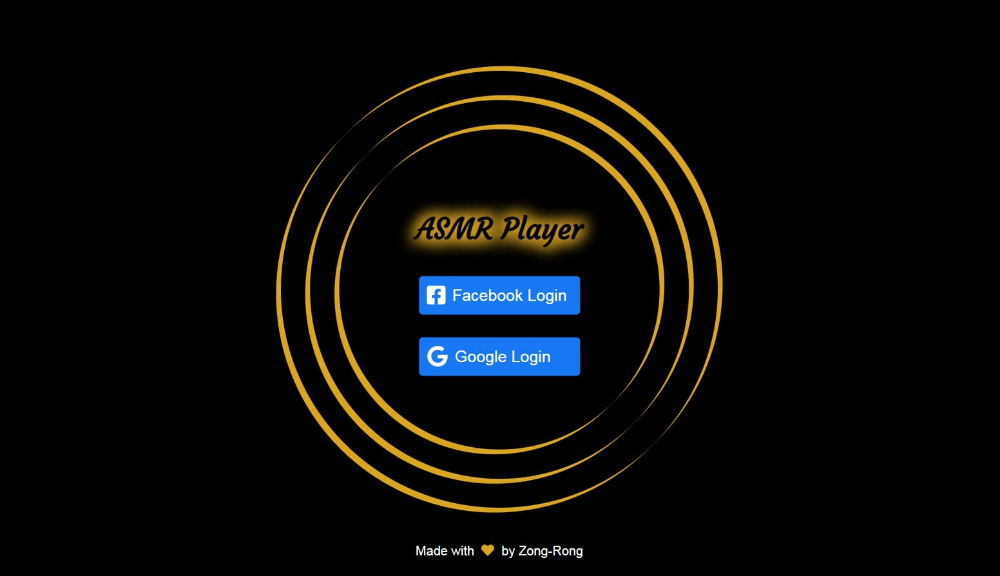

# ASMR Player



**ASMR Player** combines both ambient audio recordings and visual images to provide an immersive, relaxing listening experience for the user. 

This web app is a personal side project built on React and supported technologies. 

Try out the [demo app](https://asmr-player-312716.web.app/) on Firebase.

## :beginner: Purpose

I built this web app to hone and improve on my technical proficiency of [React](https://reactjs.org), social media logins ([Facebook](https://developers.facebook.com/docs/facebook-login/) and [Google](https://developers.google.com/identity)), [Firebase](https://firebase.google.com), HTML `<audio>` element, and [Unsplash API](https://unsplash.com/developers).

## :musical_note: Features


<small>:framed_picture: Credit: [Sebastian Unrau](https://unsplash.com/photos/sp-p7uuT0tw)</small>

* It has four built-in audio recordings and four photographic works.
* When online, it can display random photograhic works from [Unsplash](https://unsplash.com/), with links to the source image and the photographer's profile page for further exploration.
* It comes with three playback modes: 
  * __Single track loop__: the app repeates single audio track.
  * __Full album loop__ (__default__): the app plays all tracks in the album in fixed order and repeats the queue.
  * __Shuffle__: the app plays the album tracks in random order. The playback is not repeated.
* It comes with social media login via Facebook and Google.

> :warning: Note:
Do not refresh the app repeatedly when it is in the online mode.<br/><br/>Unsplash API may block access from this app owning to a surge of requests. Once that happens, wait for a while to get unblocked.


## :mag: How to use it

1. Clone this project to your computer:
`git clone https://github.com/zongronghuang/asmr-player.git`

2. Install required packages:
`npm install`

3. Provide the environment variables required in an `.env` file:

    ```
    HTTPS=true

    // Unsplash API
    REACT_APP_BASE_URL=https://api.unsplash.com/
    REACT_APP_ACCESS_KEY=<YOUR ACCESS KEY>

    // Facebook login
    REACT_APP_FB_APP_ID=<YOUR APP ID>
    REACT_APP_FB_API_VERSION=<YOUR API VERSION>

    // Firebase
    REACT_APP_FIREBASE_API_KEY=<YOUR API KEY>
    REACT_APP_FIREBASE_AUTH_DOMAIN=<YOUR AUTH DOMAIN>
    REACT_APP_FIREBASE_PROJECT_ID=<YOUR PROJECT ID>
    REACT_APP_FIREBASE_STORAGE_BUCKET=<YOUR STORAGE BUCKET>
    REACT_APP_FIREBASE_DATABASE_URL=<YOUR DATABASE URL>
    REACT_APP_FIREBASE_MESSAGING_SENDER_ID=<YOUR MESSAGING SENDER ID>
    REACT_APP_FIREBASE_APP_ID=<YOUR APP ID>
    ```

4. Start this web app:
`npm start`

5. Open the web app via a web browser:
`https://localhost:3000` or `https://192.168.0.38:3000`

## :gem: Audio and visual materials

:notes: [BBC Sound Effects](https://sound-effects.bbcrewind.co.uk)

This website offers a rich collection of ambiental sounds, copyrighted by BBC, for non-comercial use.

:framed_picture: [Unsplash](https://unsplash.com/)

The built-in photographic works belong to the photographers on Unsplash respectively:
* [Sebastian Unrau](https://unsplash.com/photos/sp-p7uuT0tw)
* [Patrick Robert Doyle](https://unsplash.com/photos/31wW1qeNoeM)
* [2y.kang](https://unsplash.com/photos/Q2ykqnomVHY)
* [Artur Kraft](https://unsplash.com/photos/mZk3lQzf0Xo)

Random photographic works displayed in the online mode also come from Unsplash.

## :open_book: Copyright

I am the copyright holder of this software project. Feel free to fork and exert your creativity!

The copyright of the audio recordings and images used in the project belongs to their respective copyright holders. My use of the materials abides by their requirements.

If you intend to use audio recordings and images from this project, __show credit to the sources__. All use of the material must abide by the requirements of the sources.

